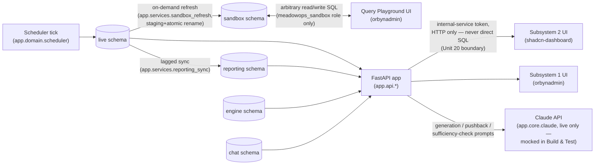

# How Data Flows

Short by design (PRD §5.8: "a short 'how data flows' doc") — the schema
itself is documented in [schema-diagram.md](schema-diagram.md) and
[data-dictionary.md](data-dictionary.md). This doc covers only the three
boundaries the PRD treats as load-bearing: the lag between `live` and
`reporting`, the hard read/write wall around `sandbox`, and the API-only
boundary between Subsystem 1 and Subsystem 2.

## 1. Operational data: scheduler → `live`

Every simulated business-date tick (`app.domain.scheduler`) advances the
world state and writes directly into `live` — the star schema plus the
Decision & Event Ledger (PRD 4.1, 4.4). This is the only schema anything
ever writes operational facts into; `reporting`, `sandbox`, and `engine`
are all downstream derivatives or unrelated stores, never upstream sources.

## 2. The lag: `live` → `reporting`

`app/services/reporting_sync.py` (Unit 17) copies `live`'s dimension/fact
keys into `reporting` on its own cadence, deliberately behind `live` — the
mechanism behind PRD's SR-2 (latency) and SR-4 (two systems disagreeing).
`reporting.sync_state` (a singleton row) tracks how far the sync has
progressed and can freeze a conflicting product/warehouse pair mid-sync for
a seeded SR-4 scenario. Nothing ever reads `reporting` back into `live`.

## 3. The sandbox wall: `live` → `sandbox`, one-way, permission-enforced

`app/services/sandbox_refresh.py` copies an explicit allowlist of 24
`live` tables (`SANDBOX_MIRRORED_TABLES` — notably excluding `live.user`
and `live.query_log`) into `sandbox` via a staging-schema-then-atomic-rename
swap, holding a Postgres advisory lock so a refresh can never race an
in-flight Playground query (PRD 9.2 edge case). This is the *only* schema
the `meadowops_sandbox` Postgres role has any privilege on at all — migration
0001 revokes `live`/`reporting`/`engine` from it explicitly, at the schema
level, so a table added by any future unit is unreachable by default
without a new grant (`test_a_table_created_later_in_live_schema_is_still_
blocked_by_default`, backend/tests/infra/test_sandbox_boundary.py). The
Query Playground's arbitrary user SQL (PRD 5.9) only ever runs as this
role, against this schema — a hard, database-enforced boundary, not an
app-layer check. `sandbox` copies carry no FKs or PK enforcement forward;
it is a flat, disposable snapshot, not a live-updating replica.

## 4. The Subsystem boundary: API only, never direct SQL

Subsystem 2 (the Analyst work-simulation engine: scenarios, chat, AI
evaluation, human review, portfolio — the `engine` and `chat` schemas) never
opens a database connection into `live`/`reporting`. Every read crosses
through the FastAPI app itself, authenticated with a dedicated
`internal_service_token` (Unit 20, DD-2) — proven end-to-end by a genuine
`httpx.ASGITransport` round trip through the real running app
(`backend/tests/integration/test_subsystem2_boundary.py`), plus a pure
AST-based checker (`app/domain/subsystem_boundary.py`,
`backend/tests/architecture/test_subsystem_boundary.py`) that fails if
anything under `app.services.subsystem2` imports `app.db.session` or a
`live`-schema ORM module directly instead of going through
`request.app.state.subsystem2_client`. This is why `engine`/`chat` can
safely reference `live.user` by
foreign key (docs/schema-diagram.md's cross-schema list) without breaking
the boundary: a foreign key is a database-level constraint, not a query
path — nothing in `app.services.scenario`/`chat`/`evaluation` ever issues
SQL against `live`'s own tables.

## 5. Claude: prompt in, structured JSON out, mocked in Build & Test

Scenario generation, pushback suggestions, and sufficiency checks
(`app.core.claude`) call the Claude API with a schema-validated JSON
response contract and exactly one automatic retry (PRD 9.2). No
`ANTHROPIC_API_KEY` is configured in this environment (`.env.example`:
"Claude API — absent during Build & Test; scenario engine runs against a
mock") — every backend test exercises this path against `MockClaudeClient`,
and the live API route 503s cleanly with no key configured. See
docs/testing-report.md and docs/walkthrough-script.md for what this means
for a live demo.
