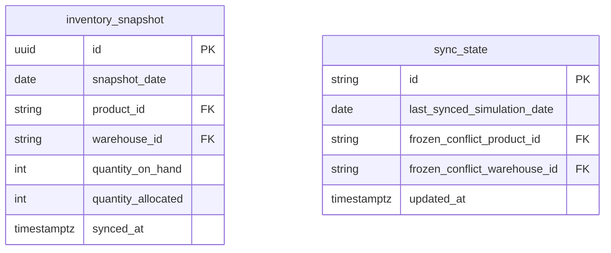
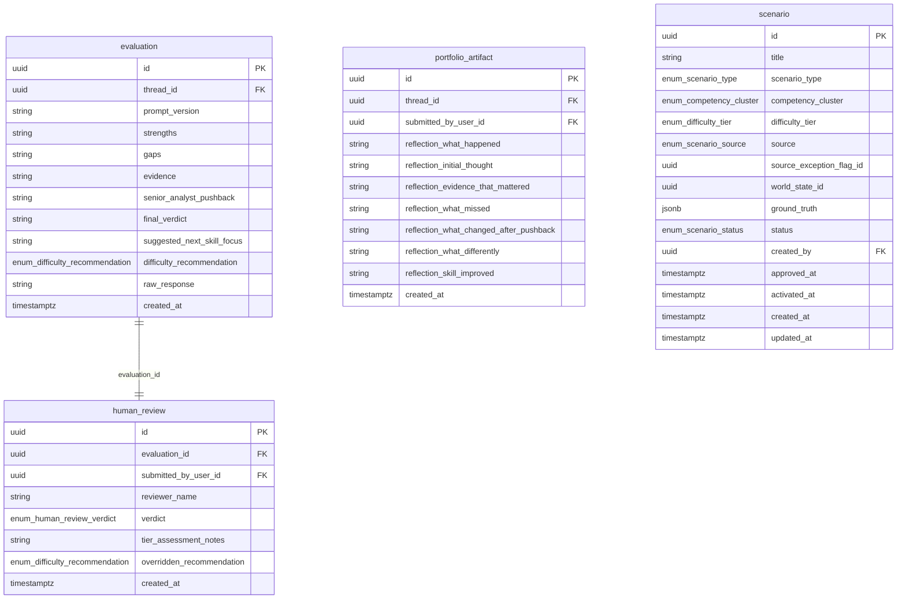
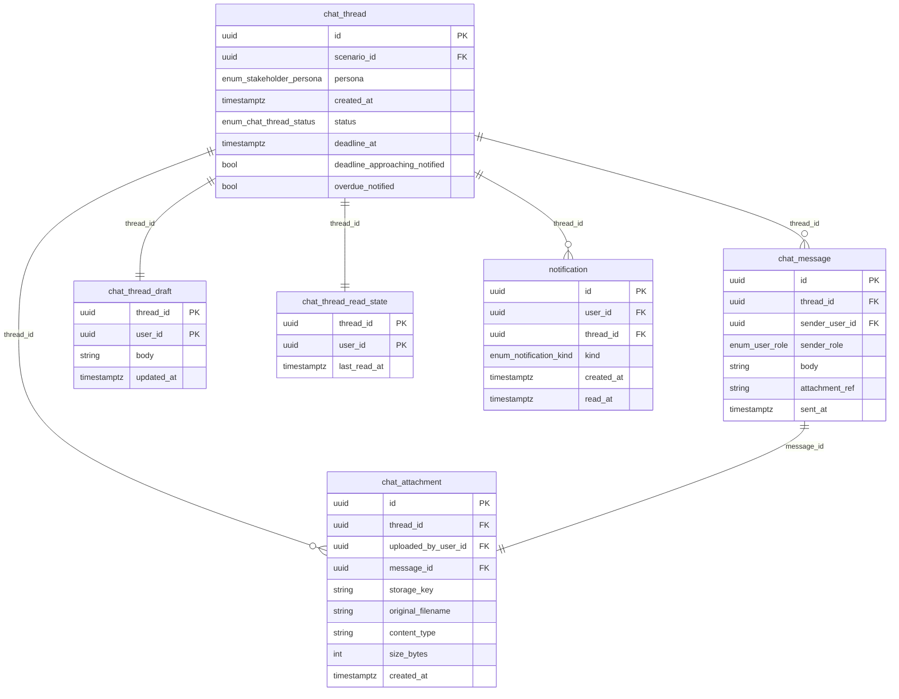

# Schema Diagram

Generated by `scripts/generate_docs.py` from the live SQLAlchemy metadata — do not hand-edit, regenerate instead. One Mermaid ER diagram per schema (38 tables, 4 schemas), plus the cross-schema foreign keys that don't fit inside a single schema's own diagram.

## Schema: `live`

Subsystem 1 operational data plus the Decision & Event Ledger (PRD 4.1). Owned by the `meadowops` role only — `meadowops_sandbox` has zero privileges here (migration 0001).

```mermaid
erDiagram
    carrier {
        string id PK
        string name
        numeric transit_days_min
        numeric transit_days_max
        enum_variability variability
        numeric reliability_pct
        bool is_active
        timestamptz created_at
        timestamptz updated_at
    }
    customer {
        string id PK
        string name
        enum_service_priority service_priority
        string warehouse_id FK
        string region
        bool is_active
        timestamptz created_at
        timestamptz updated_at
    }
    date_dim {
        date date PK
        int year
        int quarter
        int month
        int day
        int day_of_week
        bool is_month_end
        bool is_quarter_end
        bool is_year_end
    }
    days_of_supply_snapshot {
        uuid id PK
        date simulation_date
        string product_id FK
        string warehouse_id FK
        numeric days_of_supply
        timestamptz computed_at
    }
    decision_event {
        uuid id PK
        enum_record_type record_type
        enum_decision_event_status status
        uuid scenario_id
        enum_ledger_entity_type entity_type
        string entity_id
        string title
        string summary
        timestamptz proposed_at
        enum_approval_authority approval_authority
        timestamptz decided_at
        string decided_by
        timestamptz implemented_at
        enum_decision_outcome outcome
        timestamptz outcome_recorded_at
        string outcome_notes
        timestamptz stale_flagged_at
        uuid supersedes_id FK
        timestamptz created_at
    }
    exception_flag {
        uuid id PK
        string category FK
        string product_id FK
        string warehouse_id FK
        uuid purchase_order_id FK
        uuid shipment_id FK
        date simulation_date
        date first_detected_simulation_date
        numeric measured_value
        numeric threshold_value
        timestamptz detected_at
        timestamptz resolved_at
    }
    exception_rule_threshold {
        string id PK
        string name
        string description
        numeric threshold_value
        string unit
        bool is_active
        timestamptz created_at
        timestamptz updated_at
    }
    inventory_snapshot {
        uuid id PK
        date snapshot_date
        string product_id FK
        string warehouse_id FK
        int quantity_on_hand
        int quantity_allocated
        enum_source_system source_system
        timestamptz created_at
    }
    inventory_transaction {
        uuid id PK
        timestamptz transaction_at
        string product_id FK
        string warehouse_id FK
        enum_inventory_transaction_type transaction_type
        int quantity_delta
        string reference_type
        uuid reference_id
        enum_source_system source_system
        timestamptz created_at
    }
    kpi_snapshot {
        uuid id PK
        date simulation_date
        numeric otif_pct
        numeric fill_rate_pct
        numeric order_cycle_time_days
        numeric perfect_order_rate_pct
        timestamptz computed_at
    }
    product {
        string id PK
        string sku
        string name
        enum_product_category category
        numeric unit_cost
        bool is_active
        timestamptz created_at
        timestamptz updated_at
    }
    purchase_order {
        uuid id PK
        string po_number
        string supplier_id FK
        string warehouse_id FK
        date order_date
        date expected_delivery_date
        enum_purchase_order_status status
        enum_source_system source_system
        timestamptz created_at
        timestamptz updated_at
    }
    purchase_order_lifecycle_event {
        uuid id PK
        uuid purchase_order_id FK
        enum_purchase_order_status from_status
        enum_purchase_order_status to_status
        timestamptz occurred_at
        date simulation_date
    }
    purchase_order_line {
        uuid id PK
        uuid purchase_order_id FK
        string product_id FK
        int quantity_ordered
        int quantity_received
        numeric unit_cost
    }
    query_log {
        uuid id PK
        uuid user_id FK
        string query_text
        enum_query_statement_type statement_type
        enum_query_result_status result_status
        int row_count
        int duration_ms
        string error_message
        timestamptz submitted_at
    }
    sales_order {
        uuid id PK
        string so_number
        string customer_id FK
        string warehouse_id FK
        date order_date
        date requested_date
        date promised_date
        enum_sales_order_status status
        enum_source_system source_system
        timestamptz created_at
        timestamptz updated_at
    }
    sales_order_lifecycle_event {
        uuid id PK
        uuid sales_order_id FK
        enum_sales_order_status from_status
        enum_sales_order_status to_status
        timestamptz occurred_at
        date simulation_date
    }
    sales_order_line {
        uuid id PK
        uuid sales_order_id FK
        string product_id FK
        int quantity_ordered
        int quantity_shipped
        numeric unit_price
    }
    scheduled_tick {
        uuid id PK
        date simulation_date
        timestamptz executed_at
        int events_generated
        enum_scheduled_tick_status status
    }
    shipment {
        uuid id PK
        uuid sales_order_id FK
        string carrier_id FK
        string warehouse_id FK
        date ship_date
        date promised_delivery_date
        date actual_delivery_date
        enum_shipment_status status
        enum_source_system source_system
        timestamptz created_at
        timestamptz updated_at
    }
    simulation_clock {
        int id PK
        date simulation_date
        enum_clock_status status
        timestamptz last_advanced_at
        uuid current_world_state_id FK
    }
    supplier {
        string id PK
        string name
        string category_focus
        enum_cost_tier unit_cost_tier
        int base_lead_time_days
        enum_variability lead_time_variability
        numeric historical_otif_pct
        bool is_active
        timestamptz created_at
        timestamptz updated_at
    }
    user {
        uuid id PK
        string email
        string password_hash
        enum_user_role role
        bool is_active
        timestamptz created_at
        timestamptz updated_at
    }
    warehouse {
        string id PK
        string name
        string region
        int capacity_pallet_positions
        bool is_active
        timestamptz created_at
        timestamptz updated_at
    }
    warehouse_transfer {
        uuid id PK
        string product_id FK
        string from_warehouse_id FK
        string to_warehouse_id FK
        int quantity
        date transfer_date
        enum_transfer_status status
        enum_source_system source_system
        timestamptz created_at
        timestamptz updated_at
    }
    world_state {
        uuid id PK
        enum_world_state_kind kind
        date simulation_date
        string seed
        string label
        uuid parent_id FK
        timestamptz created_at
    }
    warehouse ||--o{ customer : "warehouse_id"
    product ||--o{ days_of_supply_snapshot : "product_id"
    warehouse ||--o{ days_of_supply_snapshot : "warehouse_id"
    decision_event ||--o{ decision_event : "supersedes_id"
    warehouse ||--o{ exception_flag : "warehouse_id"
    exception_rule_threshold ||--o{ exception_flag : "category"
    purchase_order ||--o{ exception_flag : "purchase_order_id"
    product ||--o{ exception_flag : "product_id"
    shipment ||--o{ exception_flag : "shipment_id"
    warehouse ||--o{ inventory_snapshot : "warehouse_id"
    product ||--o{ inventory_snapshot : "product_id"
    warehouse ||--o{ inventory_transaction : "warehouse_id"
    product ||--o{ inventory_transaction : "product_id"
    supplier ||--o{ purchase_order : "supplier_id"
    warehouse ||--o{ purchase_order : "warehouse_id"
    purchase_order ||--o{ purchase_order_lifecycle_event : "purchase_order_id"
    product ||--o{ purchase_order_line : "product_id"
    purchase_order ||--o{ purchase_order_line : "purchase_order_id"
    user ||--o{ query_log : "user_id"
    warehouse ||--o{ sales_order : "warehouse_id"
    customer ||--o{ sales_order : "customer_id"
    sales_order ||--o{ sales_order_lifecycle_event : "sales_order_id"
    product ||--o{ sales_order_line : "product_id"
    sales_order ||--o{ sales_order_line : "sales_order_id"
    carrier ||--o{ shipment : "carrier_id"
    sales_order ||--o{ shipment : "sales_order_id"
    warehouse ||--o{ shipment : "warehouse_id"
    world_state ||--o{ simulation_clock : "current_world_state_id"
    warehouse ||--o{ warehouse_transfer : "to_warehouse_id"
    warehouse ||--o{ warehouse_transfer : "from_warehouse_id"
    product ||--o{ warehouse_transfer : "product_id"
    world_state ||--o{ world_state : "parent_id"
```

## Schema: `reporting`

A deliberately-lagged shadow copy of `live`'s dimension/fact keys (PRD 4.1, SR-2), refreshed on its own cadence so the dashboard can realistically "not have caught up yet" and disagree with `live` (SR-4).

## Schema: `engine`

Subsystem 2's own supporting tables: scenario definitions/state, AI evaluation drafts, human review verdicts, portfolio artifacts. Never read directly by Subsystem 1 — only via the API boundary (Unit 20, see docs/data-flow.md).

## Schema: `chat`

The Analyst<->Builder persona-chat delivery layer (threads, messages, read state, drafts, attachments, notifications), added in Unit 21a.

## Cross-schema references

Not renderable inside a single schema's own diagram above (Mermaid `erDiagram` doesn't group entities into schema-labeled boxes). Every one of these points at `live.user` (authentication lives in exactly one place), `engine.scenario`, or `chat.chat_thread` — there is no case of `live`/`reporting` reading forward into `engine`/`chat`:

- `chat.chat_attachment.uploaded_by_user_id` → `live.user.id`
- `chat.chat_message.sender_user_id` → `live.user.id`
- `chat.chat_thread.scenario_id` → `engine.scenario.id`
- `chat.chat_thread_draft.user_id` → `live.user.id`
- `chat.chat_thread_read_state.user_id` → `live.user.id`
- `chat.notification.user_id` → `live.user.id`
- `engine.evaluation.thread_id` → `chat.chat_thread.id`
- `engine.human_review.submitted_by_user_id` → `live.user.id`
- `engine.portfolio_artifact.submitted_by_user_id` → `live.user.id`
- `engine.portfolio_artifact.thread_id` → `chat.chat_thread.id`
- `engine.scenario.created_by` → `live.user.id`
- `reporting.inventory_snapshot.product_id` → `live.product.id`
- `reporting.inventory_snapshot.warehouse_id` → `live.warehouse.id`
- `reporting.sync_state.frozen_conflict_product_id` → `live.product.id`
- `reporting.sync_state.frozen_conflict_warehouse_id` → `live.warehouse.id`

`sandbox` mirrors 24 of `live`'s tables as plain, unconstrained copies (no FKs, no PK enforcement carried over) — see docs/data-flow.md.
